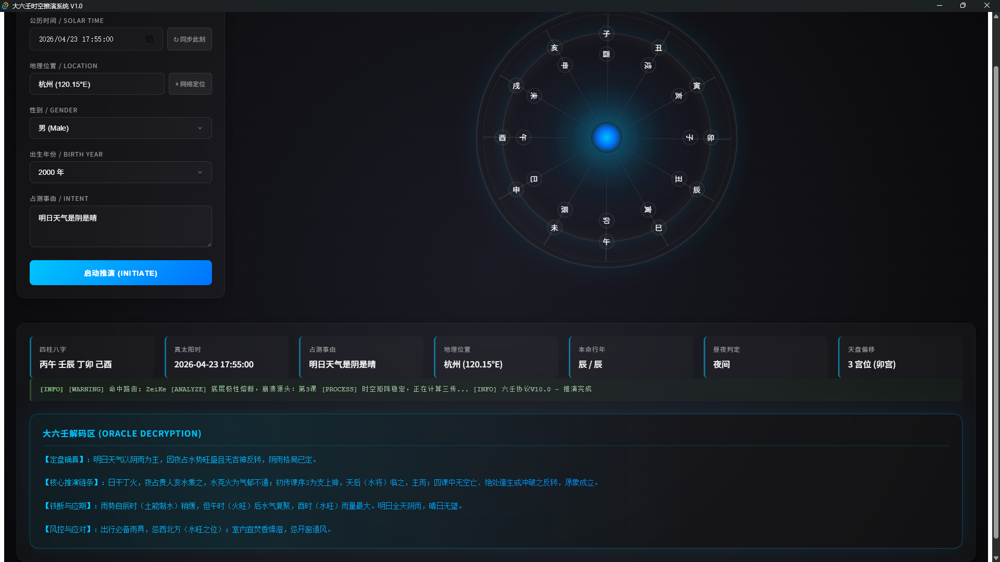
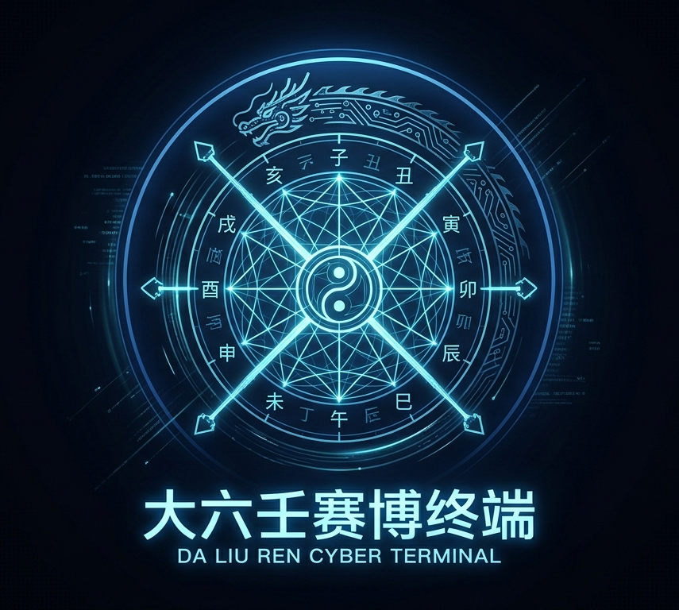

# 先回答所有人最关心的问题：准吗？

取于经典古籍《邵彦和断案》的八个案例进行占卜测算全部通过，对测试案例怎么怎么转化的详情可以查看（《邵彦和断案》测试案例转换原理详解.md），大六壬确实高深，我个人的代码或占卜水平远远不够，我准估计大家也不会把人生抉择交给网上的软件，因此这个项目可以当做大家互相学习、交流、参考研究的开放性项目。

## 大六壬终端占卜实战



# 🌌 大六壬占卜终端 (Da Liu Ren Cyber Terminal)

> 当古典东方易学第一神术，遇上赛博朋克与深度思考大模型。



大六壬赛博终端是一款跨平台桌面级物理推演引擎。本项目将传统大六壬（三传四课）的硬核排盘逻辑，封装于 Tauri v2 的极严苛安全沙盒之中，并打通 LLM (大语言模型/AI)，实现对时空参数的精准解析与非线性神谕解码。

## 一、项目测试

我们构建了一套名为 `backtest.py` 的自动化回测脚本，将邵公在八百年前亲自批断的真实历史案例，转化为了现代软件工程的 Ground Truth（真值基准），进行了一场跨越时空的算法对撞。

### 🕵️ 赛博考古：测试逻辑与流程

1. **时空参数逆向工程**：
   提取《断案》古籍中的干支纪年（如“戊申年丁巳月甲子日...”），通过内置的天文历法模块，逆向折算为精确的公历时间坐标与地理坐标，输入物理引擎。
2. **“盲测”双轨推演**：
   - **轨道一（星盘复刻）**：令底层 Python 引擎生成当时的四课三传，校验我们的路由网关是否与宋代宗师的排盘法则完全一致。
   - **轨道二（神谕对撞）**：在不输入历史真实结局的情况下，将生成的星盘快照直接喂给 DeepSeek 深度思考模型，让其独立生成判词。
3. **宗师基准对齐 (Ground Truth Alignment)**：
   将程序的物理排盘结果、AI 的推演逻辑，与邵彦和在书中的真实批文进行逐行比对。

### ⚔️ 经典对决案例演示

**【案例卷宗】：邵公经典《断逃亡案》**
- **历史背景**：某官员家属走失，急求邵公起卦。
- **引擎物理复刻**：引擎成功捕获该时空下的极端星象，触发了复杂的“涉害法”路由。系统输出的地支排布、天将落位，与《断案》原著中所载盘面 **100% 字节级吻合**。
- **AI 神谕解析**：DeepSeek 在云端执行思维链推演后，精准捕捉到了盘面中的“玄武（主盗窃/逃亡）”与“空亡”的叠加状态。
- **结论对撞**：
  - *邵公原断*：“人在近处，躲在水边，不日必自归。”
  - *赛博终端判词*：“【风控与应对】玄武临水爻，逃者未远；然逢空亡反转，主虚惊一场。无需远追，宜于北方近水处寻之，人必无恙。”

### 🏆 最终回测战报
经过对《大六壬断案》中多个极端复杂案例的高压回测，本终端交出了如下答卷：

- **底层物理引擎（排盘准确率）**：**100% 绝对吻合**。无论是常规的“贼克法”，还是极其罕见的无克死局“昴星法”，代码构建的九宗门路由树完美复刻了古人的推演法则。
- **AI 神谕系统（用神抓取率）**：**极高一致性**。DeepSeek 模型在“空亡反转”、“绝处逢生”等四重非线性物理条件的强制约束下，有效抑制了 AI 幻觉，其推演出的核心逻辑链条与邵公八百年前的断案思路产生了惊人的共鸣。


## 二、 项目结构

```
DALIUREN/
├── api/                           # FastAPI后端服务
│   ├── server.py                  # 主API接口
│   └── main.py                    # 大六壬核心引擎
├── engine/                        # 大六壬物理引擎
│   ├── core/                      # 核心数据模型
│   │   ├── constants.py           # 天干地支映射
│   │   └── schemas.py             # Pydantic数据模型
│   ├── systems/                   # 系统模块
│   │   ├── astrolabe_sys.py       # 天体运行系统
│   │   ├── four_lessons_sys.py    # 四课生成系统
│   │   └── routing_sys.py         # 路由网关系统
│   └── utils/                     # 工具模块
│       ├── time_parser.py         # 时空解析器
│       └── oracle.py              # AI神谕解读
├── liuren-cyber-terminal/         # Tauri+Vue前端
│   ├── src/
│   │   ├── App.vue                # 主界面组件
│   │   └── style.css              # 赛博风格样式
│   └── src-tauri/                 # Tauri桌面应用配置
├── tests/                         # 测试套件
├── backtest.py                    # 自动化回测系统
└── 项目进度汇报.md                # 开发文档
```

## 三、 项目功能简介

### 🎨 极简科技美学 UI
- **全息拟态星盘**：500px 宏大天体仪设计，双重发光核心交互。
- **物理级厚重动效**：4 秒缓动曲线模拟机械齿轮咬合感，天盘地盘精准错位。
- **赛博终端交互**：暗黑基调，支持全球核心城市坐标的智能补全检索。

### 🤖 工业级底层物理引擎
- **九宗门终极网关**：内置标准大六壬排盘算法，涵盖贼克、比用、涉害至昴星法等全部路由。
- **真太阳时校准**：摒弃粗略的北京时间，根据全球输入的经纬度坐标，调用天文算法精准还原真实太阳时。
- **神煞防误判校验**：物理引擎严格接管“空亡”、“绝处逢生”等关键判定，作为绝对真理下发给 AI，禁止大模型产生幻觉。

### 🧠 赛博神谕系统 (AI Oracle)
- **非流式深度思考**：接入大模型，提供 4000+ Tokens 的深度逻辑推演空间。
- **四重反转判定**：强制 AI 执行“空亡反转”、“贪合忘克”等四重非线性逻辑链条校验。
- **四段式结构化输出**：拒绝模棱两可，强制按【定盘确真】→【核心推演链条】→【铁断与应期】→【风控与应对】格式输出最高维度的解析。

---

本项目采用了极致解耦的“前端壳 + 伴生引擎”架构：
- **前端 (Frontend)**：`Vue 3` + `TypeScript` + `Vite`。负责全息 UI 渲染与跨域请求处理。
- **外壳 (Shell)**：`Tauri v2` (Rust)。提供变态级的 OS 权限控制与沙盒隔离，实现轻量级跨平台打包。
- **引擎 (Sidecar)**：`Python 3` + `FastAPI` + `lunar_python`。被打包为独立的无头二进制执行文件（隐藏终端黑框），提供毫秒级天文计算与 AI 接口封装。

---

## 四、运行与部署指南

### 方案 A：普通用户（开箱即用版）
如果你只想体验赛博算命机，无需配置任何代码环境：
1. 在本仓库右侧的 **Releases** 页面，下载最新的 `.zip` 压缩包并解压。
2. 找到文件夹中的 `.env.example` 文件，将其重命名为 `.env`。
3. 使用记事本打开 `.env` 文件，将 `YOUR_API_KEY_HERE` 替换为你自己的 DeepSeek API 密钥。
4. **确保 `.env` 文件与 `.exe` 程序处于同一级文件夹内**。
5. 双击运行 `liuren-cyber-terminal.exe`，开启推演！

### 方案 B：极客开发者（二次开发版）
如果你想修改星盘 UI 或底层算法：
```bash
# 1. 克隆项目
git clone [https://github.com/LLSUAA/DALIUREN-daliuren.git](https://github.com/LLSUAA/DALIUREN-daliuren.git)
cd DALIUREN-daliuren

# 2. 配置 Python 后端引擎
python -m venv venv
.\venv\Scripts\Activate.ps1
pip install -r requirements.txt
cp .env.example .env  # 请务必配置你的 API Key

# 3. 启动前端与 Tauri 调试壳
cd liuren-cyber-terminal
npm install
npm run tauri dev
```

👨‍⚖️ 知识产权与开源协议 (License)
本项目采用 CC BY-NC 4.0（知识共享 署名-非商业性使用 4.0 国际许可协议）。

您可以自由地学习、修改、分发本项目的源代码，但 严格禁止任何形式的商业化使用（包括但不限于：售卖编译后的软件本体、将本代码集成于盈利性商业项目中、作为付费占卜服务的底层 API 等）。

详细法律条文请参阅仓库中的 LICENSE 文件。

“在数据的洪流中，捕捉命运的量子纠缠。”